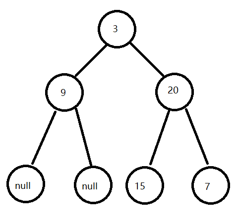
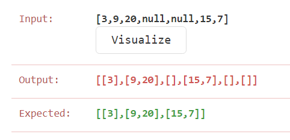

#  102.二叉树的层次遍历

##  一.二叉树的遍历

1.  BFS 广度优先搜索
2.  DFS 深度优先搜索



*  二叉树数据结构java实现
   *  采用的链表实现方式
*  toString方法用于打印 System.out.print(list.toString());自定义打印需求
```
public class TreeNode {
    int val;
    TreeNode left;
    TreeNode right;

    TreeNode(int x) {
        val = x;
    }

    @Override
    public String toString() {
        return val + "";
    }
}
```

**每一个子树都遵循遍历方式**
-  前序遍历
   -  思想：按照根节点->左子树->右子树的顺序访问二叉树
   -  步骤：（1）访问根节点；（2）采用先序递归遍历左子树；（3）采用先序递归遍历右子树；
   -  样例前序遍历结果：3 9 20 15 7
*  java实现前序遍历 获得节点引用 通过节点引用可获取节点信息
   *  采用队列 先进先出 特点 并递归子树  还可不用递归
```
public static List<TreeNode> preOrder(TreeNode root) {
        if (root == null) {
            return null;
        }
        Queue<TreeNode> queue = new LinkedList<>();
        List<TreeNode> list = new ArrayList<>();
        queue.add(root);
        while (!queue.isEmpty()) {
            root = queue.poll();
            list.add(root);
            if (root.left != null ) {
                queue.add(root.left);
                preOrder(root.left);
            }
            if (root.right != null ) {
                queue.add(root.right);
                preOrder(root.right);
            }
        }
        return list;
    }
```
-  中序遍历
   -  思想：按照左子树->根节点->右子树的顺序访问
   -  步骤：（1）采用中序遍历左子树；（2）访问根节点；（3）采用中序遍历右子树
   -  样例中序遍历结果：9 3 15 20 7
*  java实现中序遍历 获得节点引用 通过节点引用获取节点信息
   *  开始尝试使用队列 以为 与前序遍历 类似 ，然而没能解出来
   *  采用栈 后进先出 特点
```
public static List < TreeNode > inorderTraversal(TreeNode root) {
        List < TreeNode > res = new ArrayList < > ();
        Stack < TreeNode > stack = new Stack< >();
        TreeNode curr = root;
        while (curr != null || !stack.isEmpty()) {
            while (curr != null) {
                stack.push(curr);
                curr = curr.left;
            }
            curr = stack.pop();
            res.add(curr);
            curr = curr.right;
        }
        return res;
    }
```   
   
-  后序遍历
   -  思想：按照左子树->右子树->根节点的顺序访问
   -  步骤：（1）采用后序递归遍历左子树；（2）采用后序递归遍历右子树；（3）访问根节点；
   -  样例后序遍历结果：9 15 7 20 3
*  java实现后序遍历 获得节点引用
```
LinkedList<TreeNode> res = new LinkedList<>();
        LinkedList<TreeNode> stack = new LinkedList<>();
        if (root == null) {
            return res;
        }
        stack.add(root);
        while (!stack.isEmpty()) {
//            取顶端节点
            root = stack.pollLast();
//            倒序添加
            res.addFirst(root);
            if (root.left != null) {
                stack.add(root.left);
            }
            if (root.right != null) {
                stack.add(root.right);
            }
        }
        return res;
```
-  层序遍历
   -  思想：按照层次顺序进行访问
   -  步骤：第一层 第二层 ...
   -  样例层序遍历：3 9 20 15 7

##  102.解题思路
##  题目要求返回节点的值
1.  采取队列数据结构获取层序遍历的节点顺序
2.  队首为root节点  root遍历结束后出队列 此时对头为root的左孩子节点
3.  第一次设计时没有考虑count计数器会出现如下错误 可以看出 这只是将同一个分支加入了level列表 而我们需要在level列表中加入同一层次的节点



*  修改过后成功通过
```
public static List<List<Integer>> levelOrder(TreeNode root) {
        if (root == null) {
            return new ArrayList<>();
        }
        List<List<Integer>> lists = new ArrayList<>();
        Queue<TreeNode> queue = new LinkedList<>();
        queue.add(root);
        while (!queue.isEmpty()) {
            List<Integer> level = new ArrayList<>();
            int count = queue.size();
            while (count > 0) {
                root = queue.poll();
                level.add(root.val);
                if (root.left != null) {
                    queue.add(root.left);
                }
                if (root.right != null) {
                    queue.add(root.right);
                }
                count--;
            }
            lists.add(level);
        }
        return lists;
```
