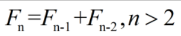
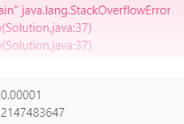

#  斐波那契数列
**有一种数列 1 1 2 3 5 8 13 21 ......**
*  前两个元素为1 其它均为前两个元素之和 即满足


*  递归
   >  一个过程或函数在其定义或说明中有直接或间接调用自身的一种方法
   >>  把一个大型复杂的问题层层转化为一个与原问题相似的规模较小的问题来求解
   *  java实现  
   *  **递归退出条件的设置**
      ```
      public static int fib(int n) {
              if (n == 0) {
                  return 0;
              }
              if (n == 1) {
                  return 1;
              } 
              return fib(n - 1) + fib(n - 2);
      }
      ```

#  50.Pow(x,n) 实现
*  即计算x的n次幂
    
    *  
    *  int MIN_VALUE = -2147483648 MAX_VALUE = 2147483647
    *  n = -n 时 便会出现 2147483648 超过了最大值 这个情况需要单独处理
    
   *  解决 StackOverflowError 
      *  分治的思想
      *  java实现
      ```
      public static double myPow(double x, int n) {
              if (n > Integer.MAX_VALUE || n < Integer.MIN_VALUE){
                  return 0;
              }
              if (n < 0 && n != Integer.MIN_VALUE) {
                  return 1.0 / myPow(x, -n);
              } else if (n == 0) {
                  return 1.0;
              } else if (n == Integer.MIN_VALUE) {
      //            倒数 2147483648 > 2147483647
                  return 1.0 / (myPow(x, (-n) / 2) * myPow(x, (-n) / 2));
              } else if (n % 2 == 1) {
      //            n为奇数 比如 2^5 = 2^(2+2+1)
                  return myPow(x, (n - 1) / 2) * myPow(x, (n - 1) / 2) * x;
              } else {
                  return myPow(x, n / 2) * myPow(x, n / 2);
              }
      }
      ```
      *  当我以为能过了...
      
      
      
      *  继续优化  参考了大神的写法
      
      ```
      public static double myPow(double x, int n) {
              if (n > Integer.MAX_VALUE || n < Integer.MIN_VALUE) {
                  return 0;
              }
              if (n == 0) {
                  return 1.0;
              }
              if (n < 0) {
      //            将 Integer.MIN_VALUE 放在一起考虑
                  return ((1 / x) * myPow(1 / x, -(n + 1)));
              }
              return (n % 2 == 0) ? myPow(x * x, n / 2) : x * myPow(x * x, n / 2);
      }
      ```
      