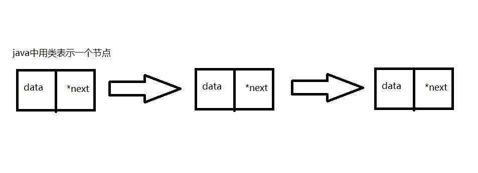

#  206.反转单链表解题思路 

##  官网题解
*  https://leetcode.com/problems/reverse-linked-list/solution/

##  单链表


>  data  表示 链表节点中存入的数据（可自定义为任何类型）

>  next  表示 当前节点指向下一个节点（存的是地址 c中的指针 java中即节点类的地址）

###  关于常用数据结构
1.  顺序表 适合查询 插入与删除效率不定 需要移动
2.  单链表 适合插入与删除 不适合查询 只能从头开始查 比如尾节点
3.  双向链表 多一个指向前驱结点的指针
4.  循环链表 尾节点指向头节点
5.  队列 ......
6.  栈 ......

###  java 实现 单链表结构

类中成员可根据需求改变  常用Object 可向下转型

```
public class ListNode {
    int val;
    ListNode next;

    ListNode(int x) {
        this.val = x;
    }
}
```


###  206.
*  时间复杂度0（n）
*  空间复杂度0（1）
```
public static ListNode reverseList(ListNode head) {
        ListNode prev = null;
//        当前结点的下一个节点将成为当前节点的上一个节点 重复操作
//        input  1 2 3 4 5 null
//        output 5 4 3 2 1 null
        ListNode tmp = null;
        while (head != null) {
//          暂存下一个节点 用于向后遍历
            tmp = head.next;
//          获得当前节点的前驱 实现反转
            head.next = prev;
//          prev保存当前节点 当前结点为下一个节点的 前驱
            prev = head;
//          遍历下一个 2
            head = tmp;
        }
//          最后一轮prev指向原链表的最后一个节点 即反转链表的头
        return prev;
    }
```

#  92.反转单链表2解题思路 
*  时间复杂度O（n）
*  空间复杂度O（1）

较上一题多一步先找到要求反转的索引位置

然后实现部分反转 部分反转与全部反转相似

```
    public static ListNode reverseList(ListNode head, int m, int n) {
        if (m == n || head == null) {
            return head;
        }
        ListNode tmp = null;
        ListNode dummy = new ListNode(0);
        dummy.next = head;
        ListNode p=dummy;
        for (int i = 0; i < m - 1; i++) {
            p = p.next;
        }
//          p.next此时为开始反转的位置
        ListNode tail = p.next;
        for (int i = m; i < n; i++) {
            tmp = p.next;
            p.next = tail.next;
            tail.next = tail.next.next;
            p.next.next = tmp;
        }

        return dummy.next;
    }
```


